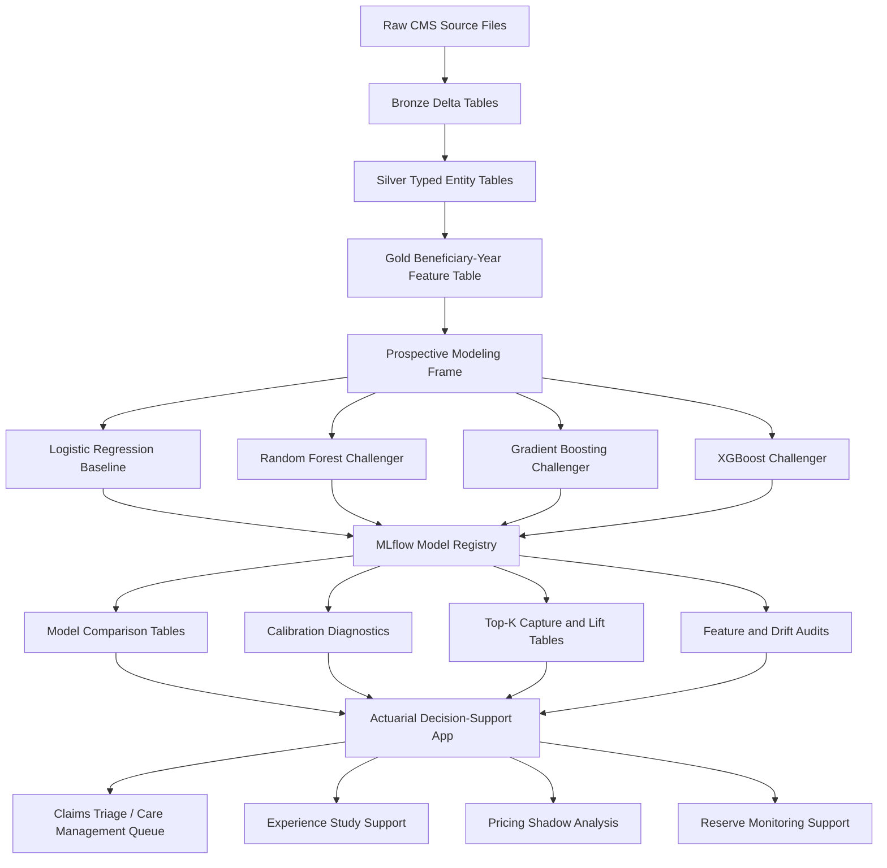
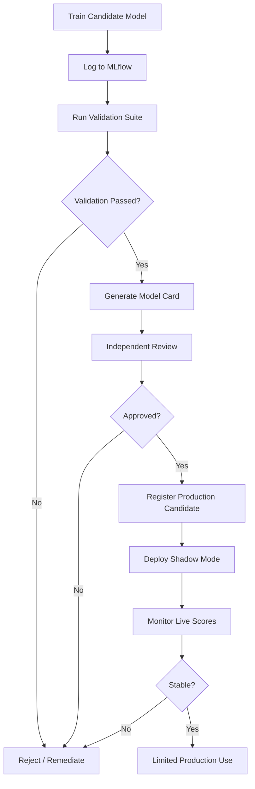

# Actuarial Machine Learning Implementation Blueprint for Codex

**Document purpose:** Convert the actuarial machine learning plan into an execution-ready Markdown specification that Codex can use to generate, refactor, test, and document the project codebase.

**Primary objective:** Build machine learning models that are not merely predictive, but actually useful to actuaries in pricing, reserving, claims triage, capital modeling, and risk management.

**Core principle:** A model is only actuarially useful if it improves a real decision, is auditable, is stable out of sample, is calibrated, and can be governed under a formal model-risk management process.

---

## 1. Executive Implementation Thesis

Machine learning should not be treated as a replacement for actuarial judgment. It should be implemented as **governed actuarial decision support**.

For this project, the strongest practical framing is:

> Build a high-cost Medicare beneficiary risk engine that produces calibrated risk scores, ranked intervention lists, model explanations, validation diagnostics, and governance artifacts that an actuary could actually use in a care-management, pricing-support, reserving-support, or capital-modeling workflow.

The current project already has the right foundation:

- CMS DE-SynPUF synthetic Medicare claims data.
- Databricks medallion architecture.
- Bronze, silver, and gold feature layers.
- One-row-per-beneficiary-year gold modeling grain.
- Prospective `year t -> year t + 1` modeling frame.
- Top-decile high-cost target.
- Logistic regression baseline.
- Random forest, gradient boosting, and XGBoost challengers.
- MLflow experiment tracking.
- Model comparison tables.
- Top-k capture and lift diagnostics.
- Calibration diagnostics.
- Feature quality and consistency audits.

The next step is to make the project operationally actuarial. That means moving from “I trained classifiers” to:

> “I built a controlled actuarial risk-ranking system with reproducible data contracts, calibrated model outputs, top-k business targeting diagnostics, sensitivity testing, monitoring, and governance controls.”

---

## 2. Codex Operating Instructions

Use this document as the implementation contract.

### Agent Execution Rule

Do not attempt to implement this entire blueprint in one pass.

Before editing code:

1. Inspect the repository.
2. Identify the smallest relevant phase or backlog item.
3. Make a minimal, reviewable diff.
4. Run compile checks and the relevant tests.
5. Summarize what changed.
6. State which acceptance criteria are now satisfied.
7. State which acceptance criteria remain incomplete.

Never modify model target logic, feature definitions, split logic, or threshold logic without explicitly checking for target leakage.

When Codex modifies code, it should preserve the following non-negotiable standards:

1. **No target leakage.**
   - Features must come from year `t`.
   - Target must come from year `t + 1`.
   - Target threshold must be computed from training data only, unless explicitly testing sensitivity.

2. **One stable modeling grain.**
   - The gold table must remain one row per `bene_id + year`.
   - Any duplicate beneficiary-year row is a blocking failure.

3. **Baseline first, challenger second.**
   - Logistic regression remains the interpretable actuarial/statistical baseline.
   - Tree models and XGBoost are predictive challengers.
   - No challenger model should be accepted unless it beats the baseline on the appropriate actuarial use metric.

4. **Ranking matters more than raw accuracy.**
   - Because the target is intentionally imbalanced, accuracy is secondary.
   - Use PR-AUC, top-k capture, lift, calibration, and operational capacity metrics.

5. **Probabilities must be calibrated.**
   - A risk score must mean something.
   - Calibration must be tested globally and by decile.

6. **Every production candidate must be reproducible.**
   - Log data version.
   - Log feature version.
   - Log split version.
   - Log model version.
   - Log package/environment metadata.
   - Log all thresholds.

7. **Every material model must have a governance packet.**
   - Intended use.
   - Prohibited use.
   - Data description.
   - Methodology.
   - Validation.
   - Limitations.
   - Monitoring plan.
   - Human-review process.

---

## 3. Target End State

The final system should contain five working layers.



---

## 4. Recommended Repository Structure

Codex should organize or refactor the project toward this structure.

```text
project2_high_cost_claim_classifier/
├── README.md
├── IMPLEMENTATION_BLUEPRINT.md
├── pyproject.toml
├── requirements.txt
├── .gitignore
├── .env.example
│
├── databricks/
│   ├── 00_config.py
│   ├── 01_bronze.py
│   ├── 02_silver.py
│   ├── 03_gold.py
│   ├── 04_train_logreg.py
│   ├── 05_train_tree_baseline.py
│   ├── 06_train_boosted_tree.py
│   ├── 07_model_comparison.py
│   ├── 08_topk_capture_lift.py
│   ├── 09_train_xgboost.py
│   ├── 10_target_sensitivity.py
│   ├── 11_feature_audit.py
│   ├── 12_calibration_diagnostics.py
│   ├── 13_gold_pipeline_consistency_check.py
│   ├── 14_logreg_variable_selection.py
│   └── jobs/
│       ├── daily_monitoring_job.json
│       ├── model_training_job.json
│       └── monthly_validation_job.json
│
├── backend/
│   ├── app.py
│   ├── schemas.py
│   ├── scoring.py
│   ├── explanations.py
│   ├── monitoring.py
│   ├── model_artifacts/
│   └── rl/
│       ├── config.py
│       ├── mdp.py
│       ├── policy.py
│       └── q_learning.py
│
├── frontend/
│   ├── app.py
│   ├── pages/
│   │   ├── 01_Risk_Score.py
│   │   ├── 02_Model_Diagnostics.py
│   │   ├── 03_Care_Management_Queue.py
│   │   └── 04_Governance.py
│   └── components/
│
├── tests/
│   ├── test_gold_contract.py
│   ├── test_target_definition.py
│   ├── test_model_metrics.py
│   ├── test_api_schema.py
│   ├── test_scoring_consistency.py
│   └── test_monitoring_rules.py
│
├── docs/
│   ├── model_card_template.md
│   ├── validation_report_template.md
│   ├── data_dictionary.md
│   ├── governance_policy.md
│   ├── actuarial_use_cases.md
│   └── deployment_runbook.md
│
├── report_artifacts/
│   ├── model_comparison_summary.csv
│   ├── calibration_summary.csv
│   ├── topk_capture_lift.csv
│   ├── feature_audit_summary.csv
│   └── validation_packet/
│
└── scripts/
    ├── run_local_tests.sh
    ├── export_artifacts.py
    ├── generate_validation_packet.py
    └── check_no_leakage.py
```

---

## 5. Actuarial Use-Case Hierarchy

Do not deploy all actuarial use cases at once. Use a staged order.

### 5.1 First Priority: Claims Triage / Care Management

**Purpose:** Rank beneficiaries by predicted next-year high-cost risk so case managers can focus on the highest-risk members.

**Why this should go first:**

- The label is available.
- The workflow can remain human-in-the-loop.
- Top-k ranking has direct operational meaning.
- False positives are less dangerous than in pricing.
- The model can be piloted without changing rates or reserves.

**Primary model output:**

```text
beneficiary_id
feature_year
risk_score
risk_decile
risk_tier
top_risk_drivers
recommended_action
human_review_flag
```

**Key metrics:**

- PR-AUC.
- ROC-AUC.
- Top-5% capture.
- Top-10% capture.
- Lift at 5%.
- Lift at 10%.
- Calibration by decile.
- Override rate.
- Intervention acceptance rate.
- Cost savings per contacted beneficiary.

**Business decision:**

```text
If risk_score is in top 5%:
    refer to intensive care-management review.

If risk_score is in 5%-10%:
    refer to moderate outreach queue.

If risk_score is elevated but explanation indicates unstable or out-of-distribution pattern:
    send to manual actuarial/clinical review.

Otherwise:
    routine monitoring.
```

---

### 5.2 Second Priority: Experience Study Augmentation

**Purpose:** Use the model and engineered features to help actuaries refresh assumptions about morbidity, utilization, persistence, cost trend, and chronic-burden segmentation.

**Actuarial value:**

- Identifies nonlinear risk segmentation.
- Finds interactions missed by manual grouping.
- Improves assumption review speed.
- Supports more credible subpopulation analysis.

**Required outputs:**

- Risk segment distribution.
- Actual-to-expected by segment.
- Morbidity/utilization trend by segment.
- Chronic burden cost relativities.
- Segment stability over time.
- Drift report.

**Use as support, not automatic assumption replacement.**

---

### 5.3 Third Priority: Pricing Shadow Model

**Purpose:** Use ML as a challenger model to test whether existing rating variables and manual actuarial assumptions are missing nonlinear structure.

**Important restriction:**

The ML model should not become the filed pricing model without explicit fairness, compliance, interpretability, and filing review.

**Required pricing diagnostics:**

- Out-of-time deviance.
- Lift.
- Calibration by rating cell.
- Loss-ratio stability.
- Fairness/disparate-impact checks.
- Variable reasonableness.
- Monotonicity checks where actuarially required.
- Comparison against GLM/GAM champion.

**Acceptance rule:**

A pricing challenger is not useful if it improves predictive lift but creates unstable, unfair, or unexplainable rate indications.

---

### 5.4 Fourth Priority: Reserving Challenger

**Purpose:** Use ML to supplement, not replace, traditional reserving methods.

**Initial reserving role:**

- Identify claim cohorts with unusual development.
- Support reserve diagnostics.
- Provide micro-level claim emergence indicators.
- Flag management-surprise risk.

**Required reserving validation:**

- Rolling-origin backtesting.
- Valuation-date reproducibility.
- Comparison to chain-ladder, Bornhuetter-Ferguson, Mack, or booked estimate.
- Bias.
- MAPE.
- RMSPE.
- Reserve range coverage.
- Stability under calendar-period shift.
- Sensitivity to large claims.

**Acceptance rule:**

A reserving model must be stable by valuation date. A model that performs well only after seeing future development is useless.

---

### 5.5 Fifth Priority: Capital Modeling and Reinsurance

**Purpose:** Use ML as a proxy or surrogate model to accelerate scenario evaluation, tail-risk approximation, and reinsurance structure testing.

**Use cases:**

- Proxy model for expensive stochastic capital simulations.
- Scenario-screening model.
- Reinsurance treaty optimization.
- Retention and attachment analysis.
- Tail-risk sensitivity.

**Required controls:**

- Validated domain of use.
- Stress testing.
- Out-of-domain abstention.
- Tail metric error.
- VaR / TVaR / CTE error.
- Treaty P&L sensitivity.
- Board-level audit trail.

---

## 6. Implementation Phases

---

## Phase 0: Freeze Scope and Decision Use

### Objective

Define exactly what the model is allowed to do.

### Codex tasks

- Create or update `docs/actuarial_use_cases.md`.
- Add a formal intended-use statement.
- Add prohibited-use statements.
- Add materiality classification.
- Add model users and decision owners.

### Required content

```md
# Intended Use

The model estimates the probability that a beneficiary-year will become high cost in the following calendar year. The model is intended for care-management queue prioritization, actuarial risk segmentation, and experience-study support.

# Prohibited Uses

The model must not be used as the sole basis for:
- denying coverage,
- changing benefits,
- pricing insurance contracts,
- booking reserves,
- making clinical decisions,
- making adverse consumer decisions without human review.
```

### Deliverables

- `docs/actuarial_use_cases.md`
- Updated `README.md`
- Model inventory row for the high-cost risk model.

### Acceptance criteria

- Intended use is clear.
- Prohibited uses are clear.
- Human-in-the-loop control is documented.
- The project is framed as decision support, not autonomous decision-making.

---

## Phase 1: Data Contract and Gold Table Hardening

### Objective

Guarantee that the modeling table is reliable, typed, auditable, and reproducible.

### Current expected grain

```text
one row = one beneficiary in one calendar year
primary key = bene_id + year
```

### Critical checks

Codex should ensure that `03_gold.py` and `13_gold_pipeline_consistency_check.py` enforce:

- `bene_id` is non-null.
- `year` is non-null.
- `bene_id + year` is unique.
- `annual_claim_cost` is numeric.
- Enrollment months are reasonable.
- Chronic condition flags are correctly parsed.
- Chronic condition count ranges from 0 to 11.
- Cost fields are nonnegative or explicitly handled.
- Required engineered features exist.
- Feature version is written as a table property.
- Failed quality checks block publication.

### Required gold metadata

Add or preserve table properties:

```text
gold_feature_version = gold_features_v2_utilization_chronic_structure
grain = beneficiary_year
primary_key = bene_id,year
source_system = cms_desynpuf
```

### Gold table quality gates

```python
BLOCKING_RULES = {
    "duplicate_bene_year_count": 0,
    "missing_bene_year_key_count": 0,
    "row_count_min": 1,
    "required_columns_present": True,
    "chronic_condition_count_valid": True,
}
```

### Deliverables

- Hardened `03_gold.py`.
- Hardened `13_gold_pipeline_consistency_check.py`.
- Gold data dictionary.
- Gold audit summary table.
- Feature version check.

### Acceptance criteria

The gold table may publish only if:

- No duplicate `bene_id + year` keys exist.
- Required columns exist.
- Required model features are populated.
- Chronic indicators are not silently collapsed.
- The audit table receives a success or failure row.

---

## Phase 2: Build Prospective Modeling Frame

### Objective

Make the model predict next-year high-cost status, not same-year cost status.

### Correct structure

```text
features from year t
target from year t + 1
```

### Required modeling frame columns

```text
bene_id
feature_year
target_year
target_annual_claim_cost
target_high_cost_threshold
label
split_name
all feature columns from feature_year
```

### Target definition

The main target is:

```text
label = 1 if target_annual_claim_cost >= 90th percentile of target annual claim cost in training data
label = 0 otherwise
```

### Leakage rules

Do not use these as features if they are from `target_year`:

- `target_annual_claim_cost`
- `target_year_high_cost_threshold`
- `label`
- next-year utilization counts
- next-year cost fields
- any field computed after the prediction date

### Codex tasks

- Centralize modeling-frame logic in a shared utility.
- Ensure all training scripts use the same modeling frame.
- Ensure the split version is shared.
- Ensure threshold is computed on training data only.
- Ensure sensitivity testing is separate from final training.

### Recommended utility

Create:

```text
databricks/modeling_frame.py
```

With functions:

```python
def build_prospective_modeling_frame(gold_df):
    ...

def assign_shared_split(modeling_df):
    ...

def compute_training_only_threshold(train_df, quantile=0.9):
    ...

def apply_threshold(modeling_df, threshold):
    ...

def validate_no_target_leakage(feature_columns):
    ...
```

### Acceptance criteria

- Same split logic across logistic regression, random forest, gradient boosting, and XGBoost.
- Same target logic across all model scripts.
- No same-year leakage.
- Target sensitivity script remains diagnostic only.

---

## Phase 3: Statistical Baseline

### Objective

Build a defensible actuarial/statistical benchmark before interpreting ML challengers.

### Model

Use logistic regression as the main baseline.

### Why logistic regression matters

It is:

- interpretable,
- familiar to actuaries,
- easier to explain,
- useful for odds ratios,
- appropriate as a baseline for binary classification,
- suitable for statistical variable selection.

### Required workflow

1. Define candidate variables.
2. Split data before model selection.
3. Fit only on training data.
4. Use backward AIC or BIC for statistical selection.
5. Preserve hierarchy for polynomial terms and interactions.
6. Check multicollinearity.
7. Report coefficients and odds ratios.
8. Evaluate on held-out test data.

### Required logistic diagnostics

- Coefficients.
- Standard errors.
- Odds ratios.
- Confidence intervals.
- VIF or collinearity diagnostics.
- Likelihood-ratio tests for blocks.
- AIC/BIC.
- Confusion matrix.
- ROC-AUC.
- PR-AUC.
- Brier score.
- Calibration by decile.
- Top-k capture/lift.

### Codex tasks

- Confirm `04_train_logreg.py` trains baseline.
- Add or refine `14_logreg_variable_selection.py`.
- Export a coefficient table.
- Export odds ratios.
- Export selected variables.
- Export likelihood-ratio block tests.
- Store results in Delta audit tables.

### Acceptance criteria

- Logistic regression can be defended in a statistics course and actuarial review.
- The selected model is not chosen using test data.
- Feature transformations are documented.
- The logistic model is the interpretability anchor.

---

## Phase 4: ML Challenger Models

### Objective

Train nonlinear challengers that improve ranking and capture high-cost members better than the logistic baseline.

### Models

Use:

- Random forest.
- Gradient boosting.
- XGBoost.

### Expected roles

| Model | Role |
|---|---|
| Logistic regression | Interpretable baseline |
| Random forest | Nonlinear benchmark |
| Gradient boosting | Balanced high-performing model |
| XGBoost | Strong ranking / high-recall challenger |

### Required challenger controls

Each challenger script must:

- Use same gold table.
- Use same modeling frame.
- Use same split version.
- Use same target definition.
- Write per-row test predictions.
- Write top-k curve points.
- Write training audit table.
- Log MLflow model with signature.
- Log model parameters.
- Log threshold rule.
- Log feature list.
- Log data version.

### Required metrics

For every model:

```text
row_count
positive_rate
accuracy
test_misclassification_error
precision
recall
f1_score
roc_auc
pr_auc
brier_score
top_5_capture_rate
top_5_lift
top_10_capture_rate
top_10_lift
decision_threshold
processed_at_utc
```

### Acceptance rule

A challenger should be considered useful only if it improves at least one operational objective without creating unacceptable weaknesses.

Example:

```text
Gradient boosting is preferred if:
- PR-AUC is higher than logistic regression,
- top-10 capture is higher than logistic regression,
- calibration gap is acceptable,
- model is stable by target year,
- explanations are plausible,
- operational false-positive burden is acceptable.
```

Do not select a model only because it has the highest accuracy.

---

## Phase 5: Calibration

### Objective

Ensure predicted probabilities are meaningful enough for actuarial decision support.

### Why calibration matters

An actuary needs to know whether a score of `0.25` means approximately 25% observed risk, at least within a reasonable score band. Poor calibration undermines pricing, reserving, case management, and capital use.

### Required calibration outputs

- Mean predicted probability.
- Observed positive rate.
- Absolute calibration gap.
- Brier score.
- Calibration by decile.
- Reliability curve points.
- Calibration plot.
- Calibration by target year.
- Calibration by key subgroup.

### Codex tasks

Extend `12_calibration_diagnostics.py` to output:

```text
model_calibration_summary
model_calibration_deciles
model_reliability_curve_points
model_calibration_by_target_year
model_calibration_by_risk_tier
```

### Suggested calibration table

| model_name | split_name | score_decile | row_count | mean_prediction | observed_rate | calibration_error |
|---|---|---:|---:|---:|---:|---:|

### Calibration acceptance criteria

A model is acceptable only if:

- Overall calibration gap is small.
- Decile calibration is directionally monotone.
- Highest-risk deciles are not materially overpromised.
- Calibration does not collapse by target year.
- Calibration is stable enough for decision support.

---

## Phase 6: Top-K Operational Targeting

### Objective

Translate model performance into care-management capacity decisions.

### Why top-k matters

In the real world, an insurer or health plan cannot intervene on everyone. The model must rank members so limited staff focus on the highest expected value cases.

### Required top-k metrics

For selected fractions:

```text
1%
2%
5%
10%
15%
20%
25%
30%
```

Compute:

```text
selected_count
captured_positive_count
capture_rate
precision_at_k
lift_at_k
average_predicted_probability
observed_positive_rate
```

### Business interpretation

If the top 10% captures 38% of high-cost beneficiaries, then the model concentrates high-cost risk roughly 3.8 times better than random selection.

### Codex tasks

Update `08_topk_capture_lift.py` to:

- Produce top-k summary CSV.
- Produce top-k chart.
- Include capacity interpretation.
- Compare all models on same held-out test population.
- Identify recommended operating threshold.

### Acceptance criteria

- Top-k calculations use held-out test predictions only.
- Selected fraction is based on rank, not a hard probability threshold.
- Curves compare models on the same population.
- Output is interpretable to nontechnical actuaries.

---

## Phase 7: Actuarial Decision Layer

### Objective

Convert model scores into recommended actions.

### Minimum decision policy

```text
risk_score >= P95:
    risk_tier = "very_high"
    recommendation = "intensive_case_management_review"

P90 <= risk_score < P95:
    risk_tier = "high"
    recommendation = "moderate_outreach"

P75 <= risk_score < P90:
    risk_tier = "elevated"
    recommendation = "monitor_and_flag_for_next_review"

otherwise:
    risk_tier = "routine"
    recommendation = "routine_monitoring"
```

### Required output fields

```json
{
  "bene_id": "string",
  "feature_year": 2009,
  "model_name": "gradient_boosting",
  "model_version": "string",
  "risk_score": 0.284,
  "risk_tier": "high",
  "operating_risk_score": 0.284,
  "recommended_action": "moderate_outreach",
  "top_risk_drivers": [
    "high chronic condition count",
    "high claims per enrollment month",
    "high provider fragmentation"
  ],
  "manual_review_required": false,
  "reason_code_version": "v1"
}
```

### Codex tasks

- Add `backend/scoring.py`.
- Add `backend/schemas.py`.
- Add `backend/explanations.py`.
- Ensure API rejects invalid inputs.
- Ensure scoring uses same feature order as training.
- Ensure outputs include reason codes.
- Ensure model version is returned with every score.

### API validation rules

Reject or flag:

- Negative costs.
- Negative claim counts.
- Enrollment months outside 1 to 12.
- Chronic condition count outside 0 to 11.
- Unknown categories not handled by training pipeline.
- Extreme values outside training percentile bounds.
- Missing required fields.

### Acceptance criteria

- API scoring is deterministic.
- Invalid input is rejected.
- Extreme but valid input is flagged.
- Every score includes model version and reason codes.
- Recommended action is tied to operating threshold.

---

## Phase 8: Explainability

### Objective

Make the model understandable enough for actuaries and reviewers.

### Required explanation types

1. **Global explanations**
   - Feature importance.
   - Partial dependence or accumulated local effects.
   - Segment-level lift.
   - Directionality checks.

2. **Local explanations**
   - Top risk drivers for one beneficiary.
   - Reason codes.
   - Comparison to peer group.
   - Manual review notes.

3. **Actuarial reasonableness checks**
   - Chronic burden should generally increase risk.
   - Prior utilization should generally increase risk.
   - Provider fragmentation may increase risk but should be interpreted carefully.
   - Partial-year enrollment should be handled carefully.

### Codex tasks

Create:

```text
backend/explanations.py
databricks/15_explainability_report.py
docs/explainability_methodology.md
```

### Reason-code example

```text
Risk score is elevated because:
1. Chronic condition count is in the top decile.
2. Claims per enrollment month is materially above average.
3. Unique provider count indicates fragmented care.
4. Prior-year total claim days are high.
```

### Acceptance criteria

- Explanations are stable.
- Explanations are not merely technical artifacts.
- Reason codes are understandable by actuaries.
- Reason codes avoid unsupported causal claims.

---

## Phase 9: Monitoring and Drift

### Objective

Detect when the model stops behaving like the validated model.

### Monitoring categories

1. **Data quality monitoring**
   - Missingness.
   - Invalid values.
   - Duplicate keys.
   - Schema changes.
   - Category drift.

2. **Feature drift**
   - Population stability index.
   - Mean/median shifts.
   - Distribution shifts.
   - Category frequency shifts.

3. **Prediction drift**
   - Mean predicted risk.
   - Risk decile distribution.
   - Top-k population volume.
   - Score distribution.

4. **Outcome monitoring**
   - Observed high-cost rate.
   - Calibration by decile.
   - Top-k capture.
   - Lift.

5. **Operational monitoring**
   - Queue volume.
   - Reviewer overrides.
   - Accepted recommendations.
   - Intervention outcomes.
   - False-positive burden.

### Alert thresholds

Suggested initial thresholds:

```text
PSI < 0.10: stable
0.10 <= PSI < 0.25: monitor
PSI >= 0.25: investigate

absolute_calibration_gap < 0.02: acceptable
0.02 <= gap < 0.05: warning
gap >= 0.05: review required

top_10_capture_drop < 10% relative: acceptable
10%-20%: warning
>20%: model review required
```

### Codex tasks

Create or update:

```text
backend/monitoring.py
databricks/16_model_monitoring.py
docs/deployment_runbook.md
```

### Acceptance criteria

- Monitoring tables are written on schedule.
- Drift thresholds are documented.
- Alerts have owners.
- Retraining triggers are explicit.
- Model can be suspended if monitoring fails.

---

## Phase 10: Governance and SR 11-7 Style Model Risk Management

### Objective

Create governance strong enough for insurance model-risk review.

This project should follow the spirit of SR 11-7 style model-risk management:

- clear model purpose,
- sound development,
- independent validation,
- ongoing monitoring,
- documentation,
- effective challenge,
- inventory control,
- change management.

### Model inventory fields

```text
model_id
model_name
model_version
owner
developer
validator
business_use
intended_use
prohibited_use
materiality_tier
data_sources
training_period
validation_period
model_type
champion_model
challenger_models
approval_status
last_validation_date
next_review_date
monitoring_frequency
retirement_date
```

### Required governance artifacts

For each production candidate:

```text
docs/model_card_<model_name>.md
docs/validation_report_<model_name>.md
docs/data_dictionary.md
docs/monitoring_plan.md
docs/change_log.md
docs/limitations_and_prohibited_uses.md
docs/human_review_policy.md
```

### Independent validation checklist

Validator must confirm:

- Intended use is appropriate.
- Data is fit for purpose.
- Target is correctly defined.
- No leakage exists.
- Splits are appropriate.
- Metrics match business use.
- Calibration is acceptable.
- Explanations are plausible.
- Monitoring is defined.
- Limitations are documented.
- Model does not exceed approved use.

### Acceptance criteria

A model cannot be promoted unless:

- Development documentation is complete.
- Validation report is complete.
- Monitoring plan is complete.
- Approval is recorded.
- Production version is locked.
- Rollback procedure exists.

---

## Phase 11: Pricing Integration

### Objective

Use the risk model as pricing support without prematurely replacing filed actuarial methods.

### Recommended role

Shadow-mode pricing challenger.

### Integration steps

1. Score historical policy/member records.
2. Add risk score as a candidate segmentation variable.
3. Compare existing rating structure against ML risk segmentation.
4. Compute actual-to-expected by rating cell and ML risk tier.
5. Identify segments where current pricing underestimates or overestimates risk.
6. Test fairness and proxy-variable concerns.
7. Generate pricing memo for actuarial review.
8. Do not file or implement until compliance review is complete.

### Pricing outputs

```text
rating_cell
exposure
actual_loss
expected_loss_current_method
expected_loss_ml_challenger
actual_to_expected_current
actual_to_expected_ml
loss_ratio_current
loss_ratio_ml
risk_score_decile
fairness_metric
```

### Acceptance criteria

ML pricing support is useful only if it:

- improves out-of-time fit,
- improves calibration,
- produces stable relativities,
- does not create unacceptable unfair discrimination risk,
- can be explained to pricing actuaries and regulators.

---

## Phase 12: Reserving Integration

### Objective

Use ML as a reserving diagnostic and challenger, not as an immediate booked-reserve replacement.

### Integration steps

1. Define historical valuation dates.
2. Freeze data as of each valuation date.
3. Train or score using only data available at valuation date.
4. Predict ultimate cost or high-cost emergence.
5. Compare to emerged outcomes.
6. Compare to booked reserve and classical reserving methods.
7. Analyze bias and volatility.
8. Produce reserve-risk flags.

### Rolling-origin backtest design

```text
valuation_date_1 -> predict emergence through later date
valuation_date_2 -> predict emergence through later date
valuation_date_3 -> predict emergence through later date
...
```

### Reserving outputs

```text
valuation_date
accident_year
development_age
booked_estimate
classical_method_estimate
ml_challenger_estimate
emerged_outcome
signed_error
absolute_error
reserve_range_lower
reserve_range_upper
coverage_flag
```

### Acceptance criteria

Reserving model is useful if it:

- identifies problematic cohorts earlier,
- reduces bias,
- reduces management surprise,
- improves reserve range coverage,
- remains stable across valuation dates.

---

## Phase 13: Capital Modeling Integration

### Objective

Use ML to accelerate stochastic scenario analysis while preserving actuarial control.

### Recommended model role

Proxy model / emulator.

### Integration steps

1. Define capital model input scenarios.
2. Run full actuarial capital model on training scenarios.
3. Train ML proxy to estimate capital outputs.
4. Validate on held-out scenarios.
5. Stress test extreme scenarios.
6. Define allowed domain of use.
7. Use proxy only inside validated domain.
8. Fall back to full model outside domain.

### Capital metrics

```text
VaR error
TVaR error
CTE error
solvency ratio error
tail scenario rank error
runtime reduction
out-of-domain flag rate
```

### Acceptance criteria

Capital proxy is useful only if:

- tail metric error is controlled,
- stress-scenario behavior is acceptable,
- runtime reduction is material,
- domain-of-use limits are enforced.

---

## Phase 14: CI/CD and MLOps

### Objective

Make the project reproducible, testable, and safe to modify.

### Required local checks

Create:

```text
scripts/run_local_tests.sh
```

Suggested content:

```bash
#!/usr/bin/env bash
set -euo pipefail

python -m compileall -q .
pytest -q
python scripts/check_no_leakage.py
```

### Required tests

| Test file | Purpose |
|---|---|
| `test_gold_contract.py` | verifies gold table grain and required columns |
| `test_target_definition.py` | verifies target threshold and no leakage |
| `test_model_metrics.py` | verifies metrics calculations |
| `test_api_schema.py` | verifies invalid inputs are rejected |
| `test_scoring_consistency.py` | verifies model feature order and deterministic scoring |
| `test_monitoring_rules.py` | verifies drift thresholds |

### CI workflow


### Model promotion workflow



### Acceptance criteria

- Code compiles.
- Unit tests pass.
- Leakage tests pass.
- Schema tests pass.
- Model artifact includes signature.
- Model card is generated before promotion.
- Human approval is required before production use.

---

## Phase 15: Documentation Standards

### Required documentation files

```text
docs/data_dictionary.md
docs/model_card_template.md
docs/validation_report_template.md
docs/monitoring_plan.md
docs/governance_policy.md
docs/human_review_policy.md
docs/deployment_runbook.md
docs/change_log.md
```

### Model card template

```md
# Model Card: <Model Name>

## 1. Model Identification
- Model name:
- Version:
- Owner:
- Developer:
- Validator:
- Approval status:

## 2. Intended Use
Describe the approved actuarial/business use.

## 3. Prohibited Use
Describe what the model must not be used for.

## 4. Data
- Source data:
- Training period:
- Validation period:
- Test period:
- Grain:
- Target definition:

## 5. Methodology
- Model type:
- Features:
- Preprocessing:
- Hyperparameters:
- Threshold rule:

## 6. Performance
- ROC-AUC:
- PR-AUC:
- Brier score:
- Top-5 capture:
- Top-10 capture:
- Calibration gap:

## 7. Validation
- Out-of-time validation:
- Sensitivity testing:
- Drift testing:
- Subgroup analysis:
- Limitations:

## 8. Monitoring
- Frequency:
- Metrics:
- Alert thresholds:
- Owner:

## 9. Governance
- Approval date:
- Next review date:
- Change log:
```

---

## 16. Specific Codex Implementation Backlog

### Backlog A: Shared modeling utilities

Create:

```text
databricks/modeling_utils.py
```

Functions:

```python
def validate_required_columns(df, required_columns):
    ...

def validate_unique_key(df, key_columns):
    ...

def validate_no_missing_key(df, key_columns):
    ...

def build_year_t_to_t_plus_1_frame(gold_df):
    ...

def assign_temporal_hash_split(df):
    ...

def compute_top_decile_threshold(train_df):
    ...

def apply_binary_label(df, threshold):
    ...

def reject_target_leakage(feature_columns):
    ...
```

### Backlog B: Shared metric utilities

Create:

```text
databricks/metric_utils.py
```

Functions:

```python
def classification_metrics(y_true, y_prob, threshold):
    ...

def topk_metrics(y_true, y_prob, selected_fractions):
    ...

def calibration_summary(y_true, y_prob):
    ...

def calibration_by_decile(y_true, y_prob):
    ...

def safe_auc(y_true, y_prob):
    ...
```

### Backlog C: Shared audit writer

Create:

```text
databricks/audit_utils.py
```

Functions:

```python
def append_delta_table(df, table_name, merge_schema=False):
    ...

def write_training_audit(metrics, table_name):
    ...

def write_prediction_scores(scores, table_name):
    ...

def write_topk_curve(points, table_name):
    ...

def write_failure_audit(run_id, status, failure_reason):
    ...
```

### Backlog D: API hardening

Update:

```text
backend/schemas.py
backend/app.py
backend/scoring.py
```

Add:

- strict Pydantic validation,
- feature bounds,
- unknown-category handling,
- model metadata in response,
- top risk drivers,
- manual review flags.

### Backlog E: Validation packet generator

Create:

```text
scripts/generate_validation_packet.py
```

It should export:

```text
report_artifacts/validation_packet/
├── model_comparison_summary.csv
├── calibration_summary.csv
├── calibration_deciles.csv
├── topk_capture_lift.csv
├── feature_quality_audit.csv
├── target_sensitivity.csv
├── model_card.md
└── validation_report.md
```

---

## 17. Model Selection Decision Rules

Use these rules to choose the model for the actuarial decision-support prototype.

### Rule 1: Reject invalid models

Reject any model with:

- target leakage,
- failed gold consistency check,
- missing feature version,
- missing MLflow signature,
- missing prediction-score table,
- no calibration diagnostic,
- no top-k evaluation,
- unstable test population definition.

### Rule 2: Baseline must be reported

Always report logistic regression, even if it is not the final champion.

### Rule 3: Operational champion is based on ranking and calibration

For care-management triage, choose the model that provides the best combination of:

1. PR-AUC,
2. top-10 capture,
3. lift at 10%,
4. acceptable Brier score,
5. acceptable calibration gap,
6. interpretable risk drivers,
7. stable target-year performance.

### Rule 4: High recall is not automatically better

A high-recall model may be bad operationally if it floods the review queue with false positives.

### Rule 5: Pricing and reserving require stricter standards

A model that is acceptable for triage may not be acceptable for pricing or reserving.

---

## 18. Actuarial Interpretation of Current Project

The project should be described as follows:

> This is an actuarial decision-support prototype for high-cost Medicare beneficiary risk. The model predicts next-year top-decile cost status from prior-year beneficiary-level claims, enrollment, demographic, and chronic-condition features. Its main use is not binary classification in the abstract; its main use is ranking beneficiaries for limited care-management capacity. Therefore, PR-AUC, top-k capture, lift, and calibration are more relevant than accuracy alone.

This framing is stronger than saying:

> “I built a machine learning classifier.”

The actuarial version emphasizes:

- prospective prediction,
- imbalanced risk,
- operational targeting,
- calibrated risk,
- limited intervention capacity,
- governance,
- validation,
- human review.

---

## 19. Minimum Production Readiness Checklist

Before calling the model production-ready, all boxes must be checked.

### Data readiness

- [ ] Gold table has no duplicate beneficiary-year keys.
- [ ] Gold feature version is written and checked.
- [ ] Required features exist.
- [ ] Chronic flags are correctly parsed.
- [ ] Missingness is audited.
- [ ] Invalid values are blocked or handled.
- [ ] Data dictionary is complete.

### Modeling readiness

- [ ] Prospective frame is used.
- [ ] Target threshold is computed from training data only.
- [ ] Shared split version is used.
- [ ] Logistic baseline is trained.
- [ ] Challenger models are trained.
- [ ] MLflow artifacts include signatures.
- [ ] Per-row predictions are stored.
- [ ] Metrics are reproducible.

### Validation readiness

- [ ] Held-out test metrics are complete.
- [ ] Calibration diagnostics are complete.
- [ ] Top-k metrics are complete.
- [ ] Target sensitivity is complete.
- [ ] Feature drift checks are complete.
- [ ] Subgroup checks are complete.
- [ ] Validation report is complete.

### Operational readiness

- [ ] API validates inputs.
- [ ] API returns model version.
- [ ] API returns risk tier.
- [ ] API returns reason codes.
- [ ] Manual-review rules are implemented.
- [ ] Monitoring tables exist.
- [ ] Alert thresholds are documented.
- [ ] Rollback plan exists.

### Governance readiness

- [ ] Model card is complete.
- [ ] Intended use is documented.
- [ ] Prohibited use is documented.
- [ ] Human-review policy exists.
- [ ] Independent validation is documented.
- [ ] Approval status is recorded.
- [ ] Change log is maintained.

---

## 20. Final Recommended Build Sequence for Codex

Use this order.

1. Refactor shared modeling-frame utilities.
2. Refactor shared metrics utilities.
3. Ensure all model scripts use the same frame, split, and target.
4. Strengthen gold consistency check.
5. Strengthen calibration diagnostics.
6. Strengthen top-k capture/lift report.
7. Generate validation packet.
8. Harden API input validation.
9. Add reason codes.
10. Add monitoring tables.
11. Add model cards.
12. Add governance documentation.
13. Add CI tests.
14. Add Streamlit governance and diagnostics pages.
15. Prepare final actuarial presentation/report artifacts.

---

## 21. What “Useful for Actuaries” Means

A machine learning model is useful for actuaries only when it satisfies all five conditions:

1. **Decision relevance**
   - It affects a real actuarial or insurance workflow.

2. **Predictive validity**
   - It performs well out of sample and out of time.

3. **Calibration**
   - Its probabilities are reliable enough for risk segmentation.

4. **Interpretability**
   - Actuaries can understand the main drivers and limitations.

5. **Governance**
   - The model can survive validation, audit, and regulatory scrutiny.

For this project, the strongest final claim is:

> The system is not merely a classifier. It is a governed actuarial risk-ranking and decision-support pipeline that connects raw claims data to calibrated model scores, operational targeting metrics, validation diagnostics, and human-reviewed intervention recommendations.

That is the standard Codex should build toward.
