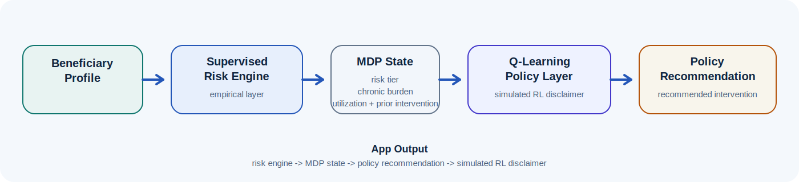

# Actuarial Decision-Support Prototype

Project 2 for Distributed Systems for Data Science.

## Project Framing

This repository implements a two-layer actuarial workflow rather than a standalone classifier.

- Risk engine: an empirically trained supervised model estimates next-year high-cost risk from beneficiary-level claim and demographic features.
- Policy layer: a simulated MDP/Q-learning intervention prototype recommends the action with the highest estimated long-run value for the beneficiary's current state.
- Governance layer: documented intended use, prohibited use, human review, monitoring thresholds, validation packet generation, and no-leakage checks frame the model as actuarial decision support.

The result is an interactive app that demonstrates end-to-end risk scoring, state mapping, and intervention recommendation.

The model is not approved for autonomous coverage, benefit, pricing, reserving, clinical, or adverse consumer decisions. It is a governed decision-support prototype with human review.

Use this sentence consistently in demos, docs, and presentation material:

The risk engine is empirically trained on observed data, while the reinforcement-learning policy layer is a simulated decision prototype built on stylized transition and reward assumptions.

## Core Prediction Target

For each beneficiary-year:

- `annual_claim_cost = sum(allowed_or_paid_amount across the beneficiary-year)`
- `high_cost = 1 if next-year annual_claim_cost >= Q0.90 else 0`

Features come from year `t`, the target comes from year `t + 1`, and `Q0.90` is computed on the training split only.

## Architecture

`CMS Synthetic Medicare Claims` -> `object storage / bronze` -> `Databricks silver` -> `gold beneficiary-year feature table` -> `supervised risk training` -> `FastAPI risk and policy endpoints` -> `Streamlit decision-support app`



## Two-Layer System

### Layer 1: Risk engine

- Uses the project gradient-boosting model as the default scoring model.
- Returns next-year high-cost probability, risk tier, predicted class, and engineered-feature context.
- Preserves logistic regression as the interpretable benchmark in the report and comparison artifacts.

We do not choose the winner by training fit; we choose it by held-out ranking performance after training-workflow model selection, and we treat the held-out test set as the official final comparison.

Official comparison standard:
- locked beneficiary-hash train/validation/test split
- training-sample model selection for tunable models
- validation sample for threshold tuning or tie-breaking
- one final comparison on the untouched held-out test sample

Canonical split contract:
- `split_strategy`: `beneficiary_hash_holdout`
- `shared_split_version`: `xxhash64_bene_id_mod_100_v2_beneficiary_hash_holdout`
- `test`: beneficiary hash bucket `< 15`
- `validation`: beneficiary hash bucket `15` through `29`
- `train`: beneficiary hash bucket `>= 30`

The final supervised comparison includes four model families:
- logistic regression
- random forest
- gradient boosting
- XGBoost

### Layer 2: Policy layer

- Uses a discrete MDP with 108 states.
- State dimensions:
  - risk tier
  - chronic burden
  - utilization intensity
  - prior intervention status
- Action set:
  - `no_action`
  - `low_touch_outreach`
  - `care_coordination_call`
  - `intensive_case_management`
- Uses tabular Q-learning to estimate long-run value by state and action.

## API Surface

The backend exposes:

- `POST /decision_support`: consolidated risk, state, recommendation, and simulation payload
- `POST /predict`: supervised risk output
- `POST /state`: current discrete MDP state
- `POST /recommend_action`: best action, Q-values, and policy explanation
- `POST /simulate`: side-by-side action comparison
- `GET /metadata`: supervised-model metadata plus RL-policy metadata
- `GET /health`: artifact-load health check

## Live AWS Deployment

- Streamlit app: https://rayodian-ncf.com
- Prediction API: https://rayodian-ncf.com
- Health check: https://rayodian-ncf.com/health

Grading smoke test:

```bash
PROJECT2_API_URL="https://rayodian-ncf.com" python3 test_project.py
```

## App Output

The Streamlit app displays:

- Risk prediction
- Current MDP state
- Recommended action
- Action-by-action comparison
- Visible methodology and limitation block

The recommendation text is intentionally phrased as a policy explanation derived from the current state and learned Q-values. It is not presented as causal proof.

In the demo presets, the calibrated policy now produces a readable intervention ladder:

- low-risk routine beneficiary -> `low_touch_outreach`
- moderate chronic-care beneficiary -> `care_coordination_call`
- very-high-risk complex beneficiary -> `intensive_case_management`

That separation is intentional. The policy layer is meant to optimize operational value under stylized assumptions rather than simply mirror the classifier threshold.

## Repo Layout

- `planning/`: architecture, scope, and project framing notes
- `data_ingestion/`: raw landing scripts
- `databricks/`: bronze, silver, gold, and supervised training scripts
- `backend/`: FastAPI risk engine, RL policy layer, and model artifacts
- `frontend/`: Streamlit decision-support app
- `report_artifacts/`: result tables, report discussion text, and presentation wording
- `docs/`: actuarial governance, monitoring, human-review, model-card, validation, and data-dictionary documents
- `scripts/`: local checks, leakage checks, and validation packet export
- `test_project.py`: grading-time validation script for the prediction endpoint, with an extra decision-support integration check
- `writeup_source.md` / `writeup.pdf`: one-page submission write-up

For the complete technical implementation narrative, see [`report_artifacts/full_project_implementation_report.pdf`](report_artifacts/full_project_implementation_report.pdf).

## Local Setup

```bash
cd project2_high_cost_claim_classifier
python3 -m venv .venv
source .venv/bin/activate
python3 -m pip install --upgrade pip
python3 -m pip install -r requirements-dev.txt
```

The saved model artifact was produced under Python `3.11.10` with scikit-learn `1.3.0`. Local development can use newer packages, but exact artifact reproduction should use `requirements-serving-py311.txt` in a Python 3.11 environment.

## Run Backend

```bash
./run_backend.sh
```

## Run Frontend

```bash
./run_frontend.sh
```

## Run Tests

```bash
python3 -m compileall backend tests test_project.py
pytest
./scripts/run_local_tests.sh
python3 test_project.py
```

Final local verification completed:
- `compileall` passed
- `pytest`: 33 passed, 1 skipped
- `./scripts/run_local_tests.sh` passed, including the leakage check
- `python3 test_project.py`: PASS
- backend `/health` and `/metadata` smoke checks passed
- Streamlit frontend reachability check passed

## Artifact-Compatible Serving

```bash
python3.11 -m pip install -r requirements-serving-py311.txt
python3.11 -m uvicorn backend.app:app --host 127.0.0.1 --port 8000
```

## Validation Packet

```bash
python3 scripts/generate_validation_packet.py
```

To target a deployed API instead of the in-process FastAPI app, the script calls `POST /predict` and also smoke-checks `POST /decision_support`:

```bash
PROJECT2_API_URL="https://your-api-url" python3 test_project.py
```

## Methodological Controls

This project uses a prospective target definition. Features are measured in beneficiary-year `t`, while the high-cost label is computed from annual claim cost in year `t + 1`. The high-cost threshold is computed from the training split only to avoid leakage.

The final train/validation/test split is the v2 beneficiary-hash holdout: `xxhash64_bene_id_mod_100_v2_beneficiary_hash_holdout`. It is intentionally beneficiary-level, so the same beneficiary cannot appear in multiple official comparison splits.

The modeling grain is one row per beneficiary-year, keyed by `bene_id` and `year`. Duplicate beneficiary-year rows are treated as blocking data-quality failures.

Because the positive class is intentionally rare, accuracy is not the primary evaluation metric. The project emphasizes PR-AUC, ROC-AUC, top-k capture, lift, calibration, and operational usefulness.

The reinforcement-learning layer is not trained from observed intervention outcomes. It is a simulated decision-support prototype based on explicit transition and reward assumptions.

## Submission Summary

This project builds an actuarial decision-support prototype for prospective Medicare high-cost risk prediction. CMS DE-SynPUF synthetic claims data are processed through a Databricks-style bronze, silver, and gold pipeline into a beneficiary-year modeling table. Year-`t` demographic, enrollment, chronic-condition, utilization, provider, and cost features are used to predict whether the beneficiary falls into the top decile of annual claim cost in year `t + 1`.

The supervised modeling layer compares logistic regression, random forest, gradient boosting, and XGBoost. Logistic regression is retained as the interpretable statistical baseline, while gradient boosting is used as the primary operational model because it produced the strongest held-out ranking performance. The project evaluates models using ROC-AUC, PR-AUC, confusion-matrix diagnostics, top-k capture, lift, and calibration rather than relying on raw accuracy.

The system is served through a FastAPI backend and a Streamlit decision-support frontend. The app reports the predicted high-cost probability, risk tier, current MDP state, and recommended care-management action. The policy layer is presented as a simulated MDP/Q-learning prototype, not as a causal treatment-effect model.

## Deployed API Mode

```bash
PROJECT2_API_URL="https://your-api-url" python3 test_project.py
```

## Limitations

The supervised risk engine is empirically trained on observed beneficiary data.

The policy layer is a simulated MDP/Q-learning intervention prototype built on stylized transition and reward assumptions. It is not causally learned from real intervention-response histories, and its recommendations should be interpreted as simulated operational decision support rather than validated treatment-effect guidance.

For offline RL training, episode initialization uses stylized risk probabilities by risk tier as a bootstrap device. During online policy use, the application starts from the actual supervised-model probability for the beneficiary and feeds that empirical score into state construction and transition logic.

Within the v1 simulated episode horizon, chronic burden is treated as fixed while risk tier, utilization intensity, and prior intervention status can evolve across steps.
